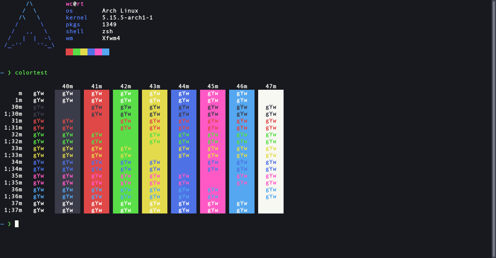

# Vampyric [XFCE Terminal](https://docs.xfce.org/apps/terminal/start)

> A dark theme for [XFCE Terminal](https://docs.xfce.org/apps/terminal/start).

## Install

Copy the [`VampyricDark.theme`](https://github.com/VampyricDark/xfce-terminal/blob/main/VampyricDark.theme) file to the local configuration directory ~/.local/share/xfce4/terminal/colorschemes.

## Activation
  1. Open the *Edit* menu and select *Preferences*
  2. Switch to the *Colors* tab
  3. Select `VampyricDark` from the *Presets* drop-down menu

## Team

This theme maintained by:

 |
--- |
[WitherCubes](https://github.com/WitherCubes) |

## License

Distributed under MIT License. See `LICENSE` for more information.
